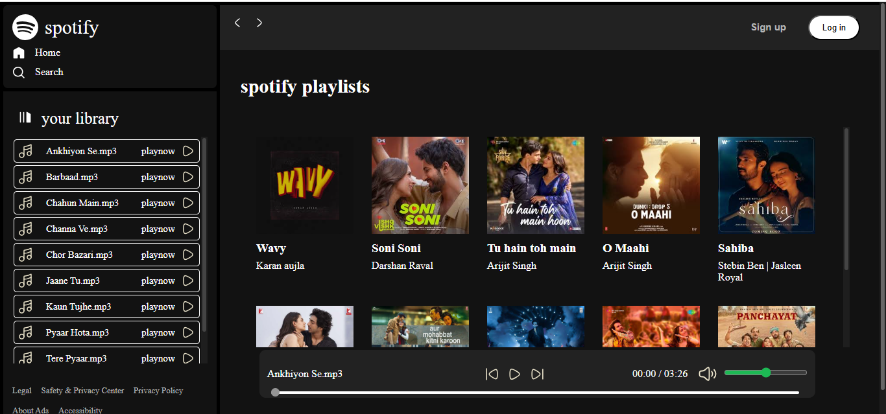

# 🎵 Musify - Spotify Clone 🎶

Musify is a Spotify-inspired web music player built with **HTML**, **CSS**, and **JavaScript**. It lets users play songs, navigate playlists, control volume, and enjoy a modern, responsive UI.

---

## 📸 Preview




---

## 🚀 Features

- 🎧 Play/Pause Songs
- ⏭️ Next & Previous Controls
- ⌛ Live Seekbar & Time Display
- 📁 Dynamic Song List (from folders)
- 🔊 Volume Control with Mute/Unmute Toggle
- 🎨 Responsive Design
- 📱 Mobile-Friendly Layout
- 🎵 Playlist Cards with Images and Artist Info

---


## 📁 Folder Structure
Musify/
│
├── css/         → style.css, utility.css
├── images/      → icons like play, volume, close, logo
├── js/          → script.js
├── library/     → optional: JSON/music meta info
├── photos/      → playlist/thumbnail images
├── songs/       → song files and folders
├── index.html   → main HTML file


## 🛠️ Tech Stack

- **HTML5** – Structure  
- **CSS3** – Styling  
- **JavaScript** – Functionality  
- **Audio API** – Music Playback  
- **Local Hosting** – For loading song folders

---

## 💻 Run Locally

1. Clone the repo:
```bash
git clone https://github.com/your-username/spotify-clone.git

Open the project folder:

cd spotify-clone
Open index.html in browser or use Live Server in VSCode.

---


```markdown
## 🙏 Credits

- Inspired by Spotify's UI
- Icons from [Iconify / Hugeicon](https://Hugeicon.com/)
- Songs used for educational/demo purposes only

## 📄 License

This project is licensed under the MIT License.

## 📬 Contact

Created by [Abhishek Mishra](mailto:abhishekmishra65836583@gmail.com)  
[LinkedIn](https://www.linkedin.com/in/iamabhishekm-dev)
